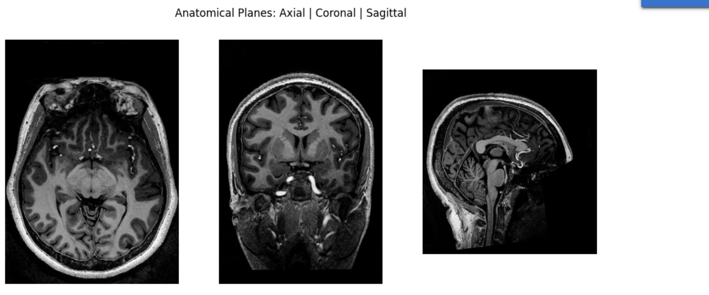

# Week 2 Report

## 1. Approach

Briefly describe your overall methodology for loading, processing, and visualizing the neuroimaging data. For example:

- **Data Loading**  
  - Used `nibabel` to load NIfTI files (`.nii`) into Python.  
  - Converted NIfTI volumes into individual DICOM slices using `pydicom` for further inspection and interoperability.

- **Metadata Extraction**  
  - Extracted key header information (shape, affine matrix, voxel spacing, data types) from NIfTI.  
  - Extracted DICOM tags (Patient Name, Study Date, Modality, Pixel Spacing, Slice Thickness, Image Position, etc.) to verify consistency and completeness.

- **Visualization**  
  - Displayed representative slices using `matplotlib` to confirm proper orientation and intensity ranges.  
  - Added annotations or overlays (e.g., scale bars, slice indices) to highlight specific features.

- **Workflow Outline**  
  1. Mount Google Drive (if necessary) and verify file paths under `/content/`.  
  2. Write a loop to load all five NIfTI files, print their basic metadata, and store them in a dictionary.  
  3. Convert each NIfTI volume to a folder of DICOM `.dcm` slices, ensuring correct pixel data type and minimal required tags.  
  4. Load a few of the generated DICOM files to extract and print their metadata.  
  5. Plot a couple of slices side by side to confirm that the conversion preserved orientation and intensity values.

---

## 2. Visualizations

Below, insert screenshots of the key plots you generated. You can add captions to clarify what each figure is showing.
   
**Figure : Axial|Coronal|Sagital Slice of sub-62038**  

## 3. Preprocessing & Assumptions

- **Reslicing & Orientation**  
  - Assumed that the original NIfTI volumes use the RAS+ convention (Right-Anterior-Superior).  
  - Did not perform any reorientation; the affine matrix from `nibabel` was used directly to determine slice position.  
  - Verified that voxel axes (R, A, S) align correctly by overlaying affine axes on a representative slice.

- **Voxel Spacing & Intensity**  
  - Extracted voxel dimensions (e.g., 0.6 mm × 0.6 mm × 0.6 mm) from `img.header.get_zooms()`.  
  - Left image intensities in their native units (e.g., 16-bit or 32-bit floats). No rescaling to 8-bit was performed.  
  - When converting to DICOM, set `SliceThickness` and `PixelSpacing` to match the NIfTI header values.

- **DICOM Metadata Defaults**  
  - Because NIfTI files lack patient-specific tags, placeholder values (“John Doe”, “123456”) were used for PatientName and PatientID.  
  - Used a fixed `StudyDate` (e.g., “20250531”) and `StudyTime` (“120000”) for all converted slices.  
  - For `ImagePositionPatient`, assumed linear stacking: `[0.0, 0.0, slice_index * voxel_thickness]`.

- **Directory Structure & File Naming**  
  - All NIfTI files reside under `/content/` in Google Colab.  
  - Converted DICOM slices are saved under `/content/dicom_output/` with filenames styled as `{nifti_basename}_slice_{N}.dcm`.  
  - Ensured output subdirectory exists before writing DICOM files.

---

## 4. Observations & Challenges Encountered

- **Consistent Orientation**  
  - When viewing NIfTI and DICOM slices side by side, they aligned correctly, confirming that the affine matrix and slice ordering were handled properly.  
  - Minor cropping or padding issues were not observed, validating that the full field of view transferred from NIfTI to DICOM without distortion.

- **Metadata Completeness & Accuracy**  
  - NIfTI does not inherently contain DICOM-specific tags (e.g., PatientName, StudyDescription), requiring manual assignment.  
  - For real-world applications, using a reference DICOM series (via tools like `nifti2dicom`) would be ideal to auto-populate all necessary tags (StudyInstanceUID, SeriesInstanceUID, etc.).

- **File Size & Memory Constraints**  
  - Loading all five NIfTI volumes concurrently was memory-intensive (hundreds of megabytes each). Consider streaming or chunked loading for larger datasets.  
  - Converting every slice into a separate DICOM file produced many small files—this can slow down file system operations and complicate downstream batch processing.

- **Format Differences & Pixel Data Handling**  
  - NIfTI stores a full 3D volume, while DICOM expects one file per slice. Ensuring correct `InstanceNumber` and `SeriesNumber` was critical to preserve the ordering.  
  - NIfTI intensities (signed or floating point) had to be cast to `uint16` for DICOM’s `PixelData`. Confirmed no significant clipping or rounding errors in sample slices.

- **Potential Improvements**  
  - Automate DICOM metadata mapping by extracting orientation vectors from the NIfTI affine and mapping them to DICOM’s `ImageOrientationPatient`.  
  - Incorporate checksums or hash comparisons to ensure bit‐for‐bit fidelity between NIfTI slice data and DICOM `PixelData`.  
  - Explore using `SimpleITK` or specialized conversion libraries (`nifti2dicom` with reference folder) to inherit full metadata (e.g., correct UIDs, PatientDemographics, SeriesDescription).

- **General Notes**  
  - Documented all assumptions in code comments to ensure reproducibility.  
  - Verified pixel-spacing and slice-thickness values in both formats match exactly to avoid geometric distortions.  
  - A key challenge was balancing minimal required DICOM tags versus more complete, real-world metadata requirements.  
